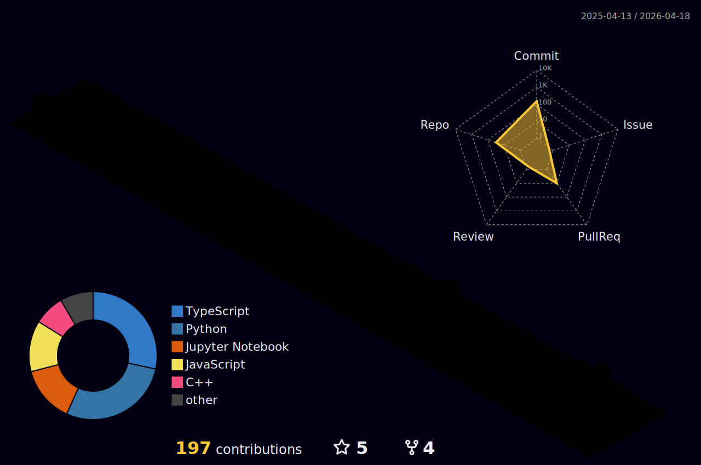

  

    
    
    

---

### 🚀 About Me

- I’m currently working on **Full-stack Web Applications & DevOps Automation**
- I’m currently learning **Advanced Kubernetes & MLOps**
- I’m looking to collaborate on **Open Source Python Projects**
- Ask me about **React, Django, CI/CD, and Data Analysis**
- Fun fact: **I automate everything I do more than twice!**

---

### 🛠️ Tech Stack

| **Category** | **Technologies** |
|:---:|:---:|
| **Languages** |  |
| **Frontend** |  |
| **Backend** |  |
| **Database** |  |
| **DevOps & Tools** |  |

---

### 📊 GitHub Stats

  
  

 

  

---

### 🏆 Achievements & Trophies

  

---

### 🐍 Contribution History

  <picture>
    <source media="(prefers-color-scheme: dark)" srcset="https://github.com/kartik1pandey/kartik1pandey/raw/output/github-contribution-grid-snake-dark.svg" />
    <source media="(prefers-color-scheme: light)" srcset="https://github.com/kartik1pandey/kartik1pandey/raw/output/github-contribution-grid-snake.svg" />
    
  </picture>

