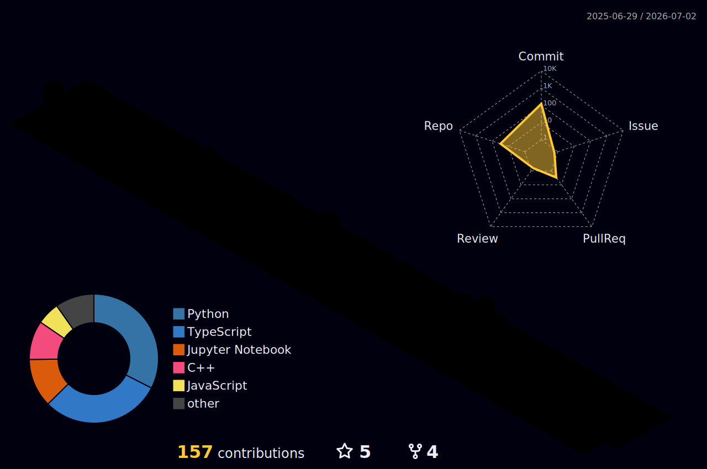

  

    
    
    

---

### About Me

- Researching **graph neural networks, hardware-aware sparse training, and LLM-guided optimization** 2 papers: *IEEE TENCON 2026* (under review) and *LION20 2026, Springer LNCS* (accepted)
- Research Intern at **University of Vienna** (DRL + LLM hybrid solvers for combinatorial optimization) and **Samsung PRISM** (ML for Linux kernel memory optimization)
- B.Tech Computer Science @ **IIIT Naya Raipur**, expected 2027
- 5x national hackathon winner · WorldQuant Brain Gold Tier · Kaggle top 7% (Rohlik Orders Forecasting)
- Open to **Applied Science / ML Research internships**
- Fun fact: 5 hackathon wins and counting still chasing #6

---

### 🛠️ Tech Stack

| **Category** | **Technologies** |
|:---:|:---:|
| **Languages** |  |
| **ML / Research** |  |
| **Systems & Infra** |  |
| **Also worked with** |  |

---

### 📌 Pinned work

Pin these from your full repo list so they're what a recruiter sees first (see the checklist for how):

- **ST-HGAT-DRIO** — spatiotemporal graph attention network for retail demand forecasting (5.4M+ records, −24.67% MAPE vs LSTM)
- **VRPAGENT Visualizer** — metaheuristic solver for 3 vehicle-routing-problem variants

---

### 🏆 Achievements & Trophies

  

---

### 🐍 Contribution History

  <picture>
    <source media="(prefers-color-scheme: dark)" srcset="https://github.com/kartik1pandey/kartik1pandey/raw/output/github-contribution-grid-snake-dark.svg" />
    <source media="(prefers-color-scheme: light)" srcset="https://github.com/kartik1pandey/kartik1pandey/raw/output/github-contribution-grid-snake.svg" />
    
  </picture>

